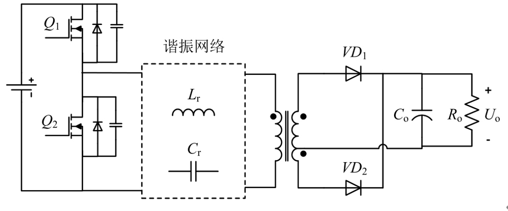

# 引言


PANDOC可以看做是处理markdown脚本的一个模板引擎。按照特定格式书写的MD文本，通过PANDOC转换可以生成各自文件如DOCX、PDF、HTML等待。

本章节定义后文中出现的术语。

术语1 字面量

MD文本中的字符串，WORD样式为“SOURCE CODE”

术语2 展示效果

通过贴图或者文本在WORD中展现排版效果。通过文本在WORD中展现的文字样式是“正文文本”或者“First Paragraph”


# 章节定义

井号和空格定义章节

一个井号和空格定义一级标题
如`# 引言`


两个井号和空格定义二级标题
如`## 代码排版的式例`

三级标题为三个井号和空格

章节和名和页码会自动排版在DOCX的目录中


# 代码排版的式例

若要在文件中穿插代码，需要对MD文本中的代码格式进行标注，格式如下。

## 行内代码
用反引号把代码包围，键盘上是左上方ESC下面的按键。
如行内代码`print("Hello, Markdown")`，在word中的样式是“SOURCE CODE”。
在MD文本该代码的字面量就是\'print("Hello, Markdown")\'，即用反引号包裹的字符串。

## 块级代码

用三个反引号包围的字符串

这是一个块级代码示例：

```
def hello():
print("Hello, Markdown")
```

在word中的样式是“SOURCE CODE”。

在MD该代码块的字面量就是

\'\'\'

def hello():

print("Hello, Markdown")

\'\'\'


# 公式和自动编号

本章节展示自动编号效果，


传递函数和公式编号的展示效果


$$G_{\mathfrak{c}}(s)=\frac{R_1+R_3}{R_1R_3C_2}\cdot\frac{\Bigg(s+\frac{1}{R_2C_1}\Bigg)\Bigg(s+\frac{1}{(R_1+R_3)C_3}\Bigg)}{s\Bigg(s+\frac{C_1+C_2}{R_2C_1C_2}\Bigg)\Bigg(s+\frac{1}{R_3C_3}\Bigg)}$$
{#eq:transF}


## 行间公式
在MD脚本中，行间公式的字面量是用两个美元符号包裹的字符串，语法格式由是latex定义的。pandoc工具会把文本形式的字符串转化为数学公式。

如[@eq:transF]不带命名的字面量是


```
$$G_{\mathfrak{c}}(s)=\frac{R_1+R_3}{R_1R_3C_2}\cdot\frac{\Bigg(s+\frac{1}{R_2C_1}\Bigg)\Bigg(s+\frac{1}{(R_1+R_3)C_3}\Bigg)}{s\Bigg(s+\frac{C_1+C_2}{R_2C_1C_2}\Bigg)\Bigg(s+\frac{1}{R_3C_3}\Bigg)}$$
```


效果就是
$$G_{\mathfrak{c}}(s)=\frac{R_1+R_3}{R_1R_3C_2}\cdot\frac{\Bigg(s+\frac{1}{R_2C_1}\Bigg)\Bigg(s+\frac{1}{(R_1+R_3)C_3}\Bigg)}{s\Bigg(s+\frac{C_1+C_2}{R_2C_1C_2}\Bigg)\Bigg(s+\frac{1}{R_3C_3}\Bigg)}$$


行间公式转换后会被加上编号。


## 行内公式
行内公式不占用编号

用单美元符号包裹的字符串即可表示

如公式$G_{\mathfrak{c}}(s)=\frac{R_1+R_3}{R_1R_3C_2}\cdot\frac{\Bigg(s+\frac{1}{R_2C_1}\Bigg)\Bigg(s+\frac{1}{(R_1+R_3)C_3}\Bigg)}{s\Bigg(s+\frac{C_1+C_2}{R_2C_1C_2}\Bigg)\Bigg(s+\frac{1}{R_3C_3}\Bigg)}$不占用编号。

其字面量如下

`$G_{\mathfrak{c}}(s)=\frac{R_1+R_3}{R_1R_3C_2}\cdot\frac{\Bigg(s+\frac{1}{R_2C_1}\Bigg)\Bigg(s+\frac{1}{(R_1+R_3)C_3}\Bigg)}{s\Bigg(s+\frac{C_1+C_2}{R_2C_1C_2}\Bigg)\Bigg(s+\frac{1}{R_3C_3}\Bigg)}$`


公式$e^{i\pi} + 1 = 0$也是行内公式，字面量为`$e^{i\pi} + 1 = 0$`。


## 公式如何编号和引用
在公式文本后一行经行标注，花括号内，如[@eq:transF]的编号定义为

'{#eq:eq_trans}'

冒号后面的字符串就表示该公式的名字，编号由pandoc-crossref生成。

在需要引用的地方，用方括号引用公式名字

`[@eq:transF]`


把[@eq:transF]的字面量和效果完全展示出来：

`$$G_{\mathfrak{c}}(s)=\frac{R_1+R_3}{R_1R_3C_2}\cdot\frac{\Bigg(s+\frac{1}{R_2C_1}\Bigg)\Bigg(s+\frac{1}{(R_1+R_3)C_3}\Bigg)}{s\Bigg(s+\frac{C_1+C_2}{R_2C_1C_2}\Bigg)\Bigg(s+\frac{1}{R_3C_3}\Bigg)}$$`

`{#eq:transF_new}`


$$G_{\mathfrak{c}}(s)=\frac{R_1+R_3}{R_1R_3C_2}\cdot\frac{\Bigg(s+\frac{1}{R_2C_1}\Bigg)\Bigg(s+\frac{1}{(R_1+R_3)C_3}\Bigg)}{s\Bigg(s+\frac{C_1+C_2}{R_2C_1C_2}\Bigg)\Bigg(s+\frac{1}{R_3C_3}\Bigg)}$$
{#eq:transF_new}

[@eq:transF_new]名字重定义为transF_new避免重复，新的行间公式编号也改变了.


# 表的设计和引用


## 表的设计


MD脚本中表  是由竖线符号 和 减号 来 构造的,表头和表身之间的横线用减号表示,表头项之间分隔排版是空格，MD脚本中用竖线符号表示。

## 表的编号

表的题注字面量是在表定义之后空一行，用冒号、井好和大括号以及字符串组成的。

冒号后用空格包裹的事表题注，花括号中定义的事表的名字，表的编号由pandoc生成。


这是一个表的示例

| a    | b    | c    |
| ---- | ---- | ---- |
| 1    | 2    | 3    |
| 3    | 2    | 1    |

: 表的题注 {#tbl:demo_table}


[@tbl:demo_table]的字面量是

```
| a    | b    | c    |
| ---- | ---- | ---- |
| 1    | 2    | 3    |
| 3    | 2    | 1    |
: 表的题注 {#tbl:demo_table}
```


## 表的引用
[@tbl:demo_table]的引用方式如下

`[@tbl:demo_table]`

用方括号来表示引用，`tbl`是表示表格引用，冒号后面是表的名字


# 图的编号和引用

## 如何插入图像

mrkdown中插入图形格式

`{  width=50% }`

方括号中是图的题注，图文件名在小括号中，大括号中是宽度等设置信息

宽度可以酌情调整，建议采用统一尺寸的图。

效果如下

{  width=50%  }

字面量为

`{  width=50%  }`

## 图的编号

在大括号中使用`#fig:名字`定义图的名字

如

`{#fig:llc_structure  width=50%  }`

[@fig:llc_structure]效果如下

{#fig:llc_structure  width=50%  }


[@fig:llc_structure]的名字为`llc_structure`，由大括号中冒号后面的字符串定义；编号自动生成。


## 图的引用

方括号格式的字符来引用图。

[@fig:llc_structure]的引用字面量为

`[@fig:llc_structure]`

冒号后为图的名字


